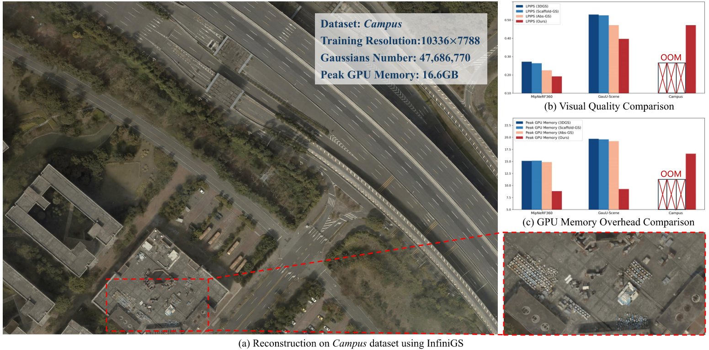
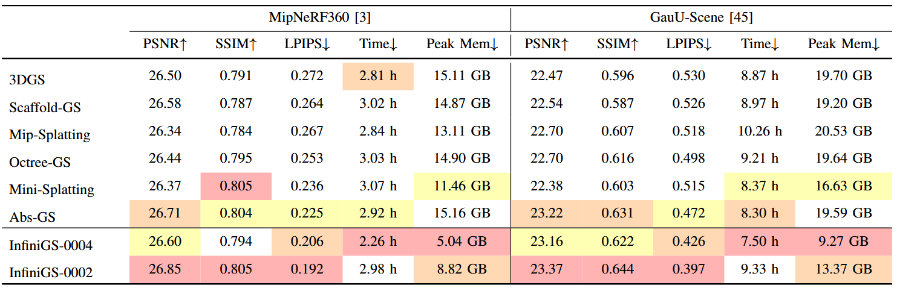

# InfiniGS: Towards Efficient Ultra-High Resolution  3D Reconstruction via Gaussian Splatting

3D Gaussian Splatting (3DGS) has attracted considerable attention due to its remarkable rendering efficiency and superior visual quality. However, typical implementations struggle with ultra-high-resolution imagery due to excessive GPU memory demands, a critical limitation particularly in domains such as aerial mapping and remote sensing, where fine-grained details are crucial for accurate 3D reconstruction. In this paper, we introduce InfiniGS, an enhanced Gaussian Splatting framework that scales up training image resolution while maintaining fidelity and efficiency, enabling reconstruction from ultra-high-resolution images without encountering out-ofmemory (OOM) issues. Extensive experiments demonstrate that InfiniGS achieves superior Novel View Synthesis (NVS) for high-resolution scenes, while requiring less memory and shorter training time. To the best of our knowledge, InfiniGS is the first method capable of reconstructing scenes with resolutions up to 10K and beyond, at full resolution and high fidelity, without exceeding the memory capacity of mainstream powerful GPUs (e.g., NVIDIA RTX 3090 with 24GB VRAM).

# Method Overview

# Quantitative Experiments

** note: All the training are done using images with original resolution

# Qualitative Experiments

